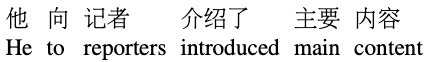

{: .box-note}
Heads Up: The post is a bit theory and math heavy!

## Predicting next words

Humans are naturally good at prediciting next words given some context. For example, for the following text:

`Please turn your homework ...`

we are able to guess with certanity that the next words could be `in`, or possibly `over`, but not something like `the` or `up`.

To teach a machine to do this we need to first formalize this intuition by assigning probability to each possible next words. We would we looking at models which assign probability to a word and even complete sentences.

### Why do we want to predict upcoming words ?

Any task that deals with noisy, ambiguous input like speech or handwriting recognition would require a way to correctly or atleast with high certainity what could be the correct word. For example, for a speech analyzer to confirm that you said:
`I will be back soonish`
and not `I will be bassoon dish`, it needs to be able to know that `back soonish` is much more probable than `bassoon dish`. Other tools like **spelling correction**, or **grammer correction** would be able to realize that `their` can be mistyped as `there` and vice versa based on the probability.

Assigning probabilities to sequence of words is also essntial for **machine translation** tasks. Lets say we are trying to translate a chinese sentence into english:



_TODO: give credits for the image._

Based on the translated words we might have formed the following probable sentences in english:

- _he introduced reporters to the main contents of the statement_
- _he briefed to reporters the main contents of the statement_
- **_he briefed reporters on the main contents of the statement_**

After assigning probabilities to these we might have been able to conclude that the third sentence is the most probable translation.

Google auto fill
google search

## Language Models

Models that assign probabilities to sequence of words are called **language models** or **LMs**. We are going to take a look at the simplest of models, the **n-gram** model.
An n-gram is a sequence of _n_ words. So a 2-gram (also called **bigram**) is a two-word sequence of words like `please turn`, `turn your`, `your homework` etc. Similarly a 3-gram (a **trigram**) is a three-word sequence of words like `please turn your` or `turn your homework`.

### N-Grams

Lets say we define probability of a word $w$, given history $h$ as :

$$
\begin{equation}
P(w|h)
\end{equation}
$$

Going back to the phrase `please turn your homework` , the probability of the next word being `in` could be represented as:

$$
\begin{equation}
P(in|please\ turn \ your \ homework)
\end{equation}
$$

One way to compute this would be to find all the occurences of the phrase `please turn your homework` and `please turn your homework in`

$$
\begin{equation}
P(in|please\ turn \ your \ homework) = \frac{C(please\ turn \ your \ homework \ in)}{C(please\ turn \ your \ homework)}
\end{equation}
$$

Finding a corpus large enough and having enough counts is a challenge even if we are scouring the internet. It might even be possible that we might not find even a single instance for the combination of words.

### Conditional Probability to the rescue

Lets start by first defining conditional probability.

We denote $P(A|B)$ as probability of $A$ given $B$. We can restate this as `what is the probability of A happening when B has already happened`
This is called conditional probability where we try to deduce the probability of any event happening given another event has already happened.

$$
\begin{equation}
P(A|B) = \frac {P(A,B)} {P(B)}
\end{equation}
$$

where:

- $P(B)$ represents the probability of event $B$ happening and
- $P(A,B)$ represents the probability of $A$ and $B$ both happening

Rewriting `equation (4)` we can get:

$$
\begin{equation}
P(A,B)=P(A|B) P(B)
\end{equation}
$$

Extending `equation (5)` to 3 events we have :

$$
\begin{equation}
P(A,B,C)= P(A|B,C) P(B|C) P(C)
\end{equation}
$$

then we can generalize `equation (6)` to n variables as :

$$
\begin{equation}
\begin{aligned}
P(A_1,A_2, A_n) = P(A_1|A_2,\dots,A_n) P(A_2|A_3,\dots,A_n)\dots P(A_{n-1}|A_n) P(A_n)\\
= \prod_{i=1}^{n}P(A_i|A_{1:i-1})
\end{aligned}
\end{equation}
$$

`Equation (6)` is also called the `chain-rule` of probability.

Coming back to the problem of assigning probabilities to words and sequence of words or an entire sentences, we can leverage `chain-rule` of probability and rewrite `equation (7)` as:

$$
\begin{equation}
\begin{aligned}
P(w_{1:n}) = P(w_1|w_2,\dots,w_n) P(w_2|w_3,\dots,w_n) \dots P(w_{n-1}|w_n) P(w_n)\\
= \prod_{i=1}^{n}P(w_i|w_{1:i-1})
\end{aligned}
\end{equation}
$$

But this seemilngly doesnot help our case as even to compute the above probabilities we would have to count the number of times every word occurs following every long sentence.

The intuition behind the n-gram model is that instead of computinh the probability of a word given its entire history, we can **approxinate** the history by just the last few words.
This assumption that the probability of a word depends only on the previous word is called a **Markov** assumption.

## Markov Models

Markov models are the class of probabilistic models that assume we can predict the probability of some future unit without having to look too far back into the past.

Lets try to understand this with the help of a bi-gram model. For a bigram model we try to predict the next word by just looking at the previous word. Looking back at `Equation (2)`

we can approximate it as:

$$
\begin{equation}
P(in|homework)
\end{equation}
$$

and generelize this for bi-gram models as :

$$
\begin{equation}
P(w_i|w_{1:i-1}) \approx P(w_i|w_{i-1})
\end{equation}
$$

Lets try to generalize this to the n-gram models. Lets use _N_ to denote the n-gram size. So N = 2 means bigram and N = 3 means trigrams. Taking `equation 10` and adjusting for _N_ we get:

$$
\begin{equation}
P(w_i|w_{1:i-1}) \approx P(w_i|w_{i-N+1:n-1})
\end{equation}
$$

Now for bigram models substituting `equation 10` into `equation 8` and N=2 we get:

$$
\begin{equation}
P(w_1|w_n) \approx \prod_{i=1}^{n} P(w_i|w_{i-1})
\end{equation}
$$

### MLE : Maximum Likelihood Estimation

Now that we have established a generalized equation to represent the probabilities for an n-gram model, the next question becomes how to we estimated these probabilities ?
An intuitive way to estimate these probabilities is **MLE**. In this method we start by getting the counts from a corpus and then **normalize** them so that tey fall between 0 and 1.

For example, to fnd the bigram probability of a word $w_n$ guven a previous word $w_{n-1}$, we will get the count if the bigram $C(w_{n-1}w_n)$ and normalize but the sum of all the bugrams that share the same first word $w_{n-1}$:

$$
\begin{equation}
P(w_n|w_{n-1}) =\frac {C(w_{n-1}w_n)}{\sum_w C(w_{n-1}w)}
\end{equation}
$$

We can further simplify this if we consider that each bigram count of words starting with word $w_{n-1}$ must be equal to unigram counts for that word $w_{n-1}$

$$
\begin{equation}
P(w_n|w_{n-1}) =\frac {C(w_{n-1}w_n)}{C(w_{n-1})}
\end{equation}
$$

Given the mini corpus of the given three sentences lets run through an example.

```
<s> I am Sam </s>

<s> Sam I am </s>

<s> I do not like green eggs and ham </s>
```

The `<s>`and `</s>` symbols are added to get the bigram context for first and last word respectively.
Lets estimate the probability of the word `I` coming after `<s>` or being the first word.

$$
C(<s>) = 3,
C(<s>,I) = 2
$$

So,
$$P(I|<s>) = C(<s>,I)/C(<s>) = 2/3 = 0.67$$

Below are some of the computed bigram probabilities from the corpus:

```
P(I|<s>) = 2/3 = .67
P(Sam|<s>) = 1/3 = .33
P(am|I) = 2/3 = .67
P(</s>|Sam) = 1/2 = 0.5
P(Sam|am) = 1/2 = .5
P(do|I) = 1/3 = .33
```

$$
$$
